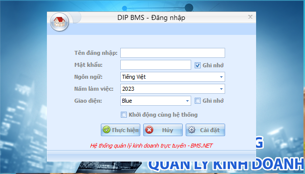
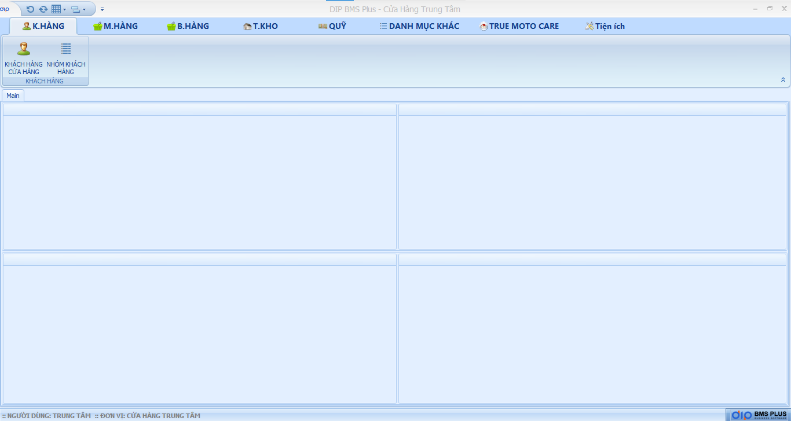

# Giới Thiệu Tổng Quan.

**Khách Hàng** : Là những khách hàng sử dụng dịch vụ tại cửa hàng.

**Mua Hàng** : Là những đơn đặt hàng mua cửa hàng đến các nhà cung cấp (Khác) ngoài danh mục của True Moto Care.

**Bán Hàng** : Là đơn hàng bán của cửa hàng cho khách hàng sử dụng dịch vụ tại cửa hàng.

**Tồn kho** : Là danh mục dùng để quản lý Tồn kho của cửa hàng, Phiếu nhập kho, Phiếu xuất kho, Danh mục sản phẩm….etc..

**Danh Mục Khác** : Là nơi quản lý các trường thông tin cơ bản : Thêm nhân viên, giới tính, Xưng hô và trả lời các cuộc khảo sát từ True Moto Care.

**True Moto Care** : Là danh mục dùng để quản lý đơn đặt hàng từ True Moto Care,Tạo tài khoản và phần quyền cho cho tài khoản sử dụng phần mềm.

**Tiện ích** : là danh mục có thể cho phép tuỳ biến giao diện phần mềm, thay đổi mật khẩu.

Dưới đây là hình ảnh tổng quan về giao diện đăng nhập và giao diện phần mềm.

<figure><figcaption>
Giao diện biểu tượng phần mềm.
</figcaption></figure>

<figure><figcaption>
Giao diện đăng nhập.
</figcaption></figure>

<figure><figcaption>
Tổng quan danh mục chức năng.
</figcaption></figure>
