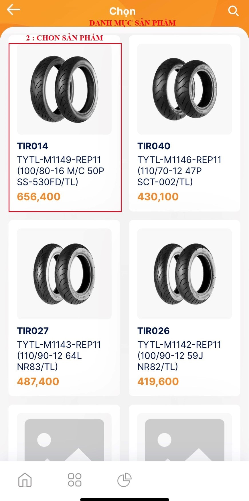

# Đơn hàng đặt mua

**Đơn Hàng Đặt Mua.**

Là danh mục mà chủ cửa hàng có thể lên đơn hàng mới và xem lại các đơn đặt hàng trước đó, để có thể tạo đơn đặt hàng ta sẽ thực hiện các bước sau :

* Bước 1 : Chọn danh mục đơn hàng nhập mua, tại đây ta sẽ chọn vào dấu cộng để thêm mới đơn hàng.
* Bước 2: Chọn mục chọn sản phẩmBước&#x20;
* 3: Chọn vào sản phẩm cần đặt muaBước&#x20;
* 4: Thêm số lượng.Bước&#x20;
* 5: Kiểm tra thông tin đơn đặt hàng.
* Bước 6 : Xác nhận và hoàn tất đơn hàng.

<figure><figcaption>
Đơn đặt hàng
</figcaption></figure>

 

<figure><figcaption>
Quản lý đơn hàng
</figcaption></figure>

<figure><figcaption>
Thêm số lượng
</figcaption></figure>

 

<figure><figcaption>
Chọn sản phẩm
</figcaption></figure>

<figure><figcaption>
Thông tin chi tiết đơn hàng
</figcaption></figure>

 

<figure><figcaption>
Xác nhận đơn hàng.
</figcaption></figure>

