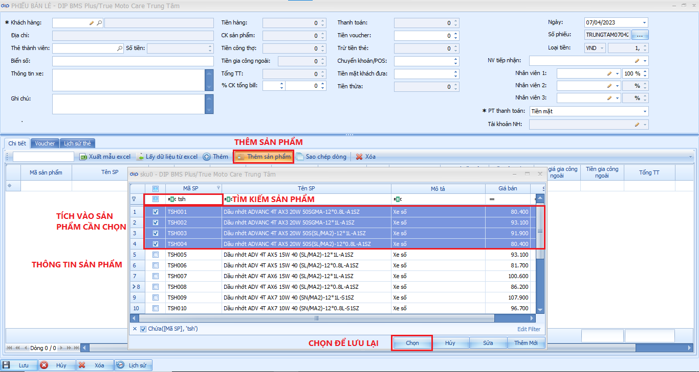

# Phiếu Bán Lẻ

**Tạo Phiếu Bán Lẻ.**

Để tạo phiếu bán lẻ ta sẽ thực hiện các bước sau :

Bước 1 : Chọn thêm mới tại mục tính năng trong phiếu bán lẻ.

Bước 2 : Chọn hoặc thêm mới khách hàng tại mục thông tin khách hàng.

Bước 3: Chọn các phụ tùng sản phẩm khách hàng cần sửa chữa thay thế.

_Lưu ý_ : nếu sản phẩm có đơn giá thay thế và gia công ngoài thì ta sẽ điền đơn giá vào ô với tên tương tự ở góc phải sản phẩm trong mục thông tin chi tiết phụ tùng.

Bước 4 :Điền các thông tin trong mục thanh toán

_<mark style="background-color:red;">Lưu ý</mark>_ <mark style="background-color:red;"></mark><mark style="background-color:red;">:</mark> Mục phương thức thanh toán sẽ có 03 hình thức là Tiền mặt, Chuyển khoản và Visa ta cần chọn đúng phương thức để tránh sai số trong các báo cáo doanh thu và quỹ.

Bước 5 : Chọn thông tin nhân viên tiếp nhận và thông tin nhân viên sửa chửa xe:

_<mark style="background-color:red;">Lưu ý :</mark>_&#x20;

* Trong trường hợp có nhiều hơn 01 NV tiếp nhận xe, thì sẽ tính tỷ lệ dựa trên quy định theo từng cửa hàng mà nhập vào.
* Cần bắt buộc nhâpk số tiền mà khách đưa, trong trường hợp không nhập sẽ tự động hiểu là khách hàng đang nợ đơn hàng này.
* Chiết khấu được chia làm 02 dạng :&#x20;
  * Chiết khấu trên sản phẩm : là CK dựa trên sản phẩm có trong đơn hàng.
  * Chiết khấu tổng đơn : là CK dựa trên tổng số tiền thanh toán đơn hàng.

<figure><figcaption>
tạo phiếu bán lẻ
</figcaption></figure>

**Chọn sản phẩm khi tạo phiếu bán lẻ.**

Có 02 cách thêm sản phẩm khi tạo phiếu bán lẻ :&#x20;

* Chọn theo từng sản phẩm : chọn từng sản phẩm trong danh mục.
* Chọn hàng loạt sản phẩm : chọn hàng loạt sản phẩm trong danh mục.

<figure><figcaption>
chọn từng sản phẩm.
</figcaption></figure>

 

<figure><figcaption>
chọn nhiều sản phẩm.
</figcaption></figure>

_<mark style="background-color:red;">Lưu ý:</mark>_ trong trường hợp chưa có thông tin khách hàng ta có thể tạo trực tiếp thông tin khách hàng trên phiếu bán lẻ như sau :

Chọn vào biểu tượng cây viết tại mục Khách hàng trên phiếu bán lẻ, sau đó sẽ hiển thị ta biểu mẫu tạo khách hàng.

<figure><figcaption>
tạo thông tin khách hàng.
</figcaption></figure>

Giờ đây, chỉ cần nhập đầy đủ thông tin khách hàng và lưu lại là đã hoàn thành tạo khách hàng.
