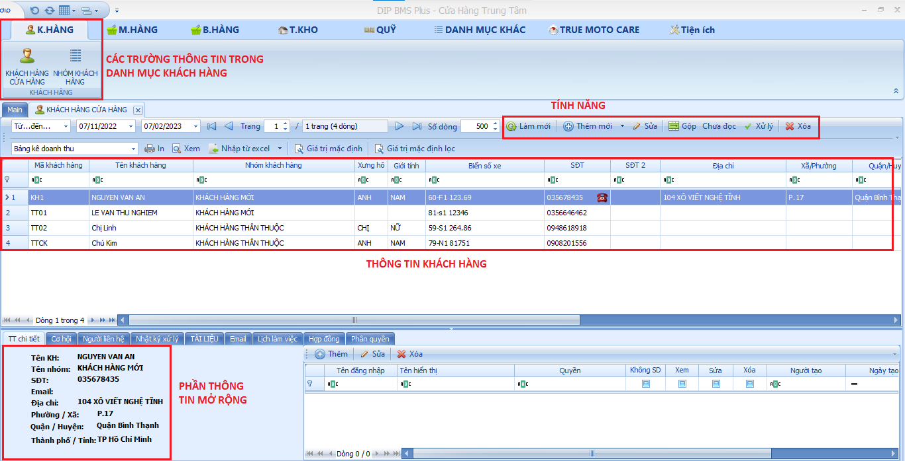

# Quản lý thông tin khách hàng

**Khách Hàng.**

Danh mục khách hàng với chức năng chủ yếu là xem và quản lý thông tin khách hàng cửa hàng từ đó cửa hàng có thể dễ dàng nắm bắt được thông tin và chăm sóc khách hàng.

Dưới đây là hình ảnh tổng quan về danh mục khách hàng:

<figure><figcaption>
Thông tin khách hàng.
</figcaption></figure>

**Tạo Thông Tin Khách Hàng.**

Để tạo thông tin khách hàng ta sẽ thực hiện các bước sau:

Bước 1: Chọn thêm mới tại mục tính năng

Bước 2: Điền đầy đủ thông tin khách hàng.

Bước 3: Lưu lại thông tin khách hàng.

_Lưu ý :_ Có hai trường thông tin bắt buộc phải điền và không được phép bỏ trống đó là _(Mã khách hàng, Tên khách hàng)._

Đối với các thao tác sửa và xoá khách hàng cũng có thể thao tác tương tự ở mục tính năng.

<figure><figcaption>
Thông tin khách hàng.
</figcaption></figure>

_**Lưu ý : Cần nhập chính xác thông tin khách hàng để True Moto Care có thể sử dụng dữ liệu và tiến hành chăm sóc khách hàng tại cửa hàng.**_
