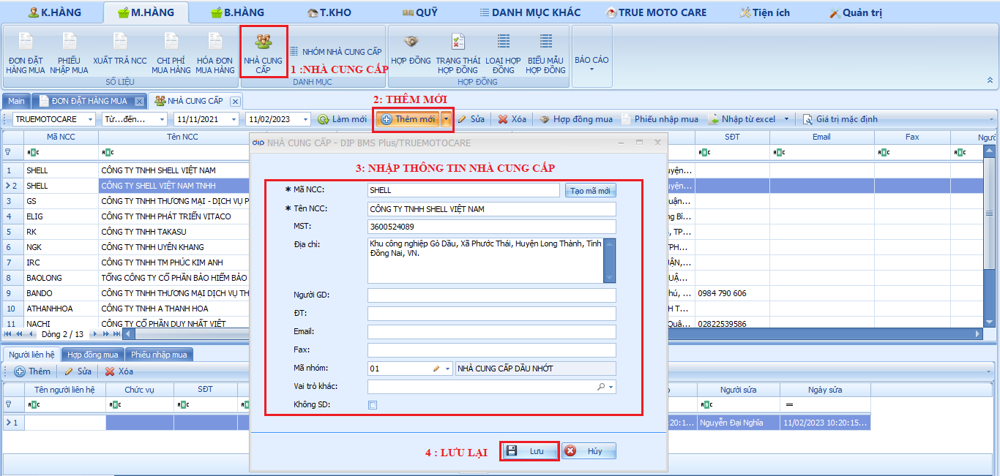

# Nhà cung cấp

Trong danh mục nhà cung cấp sẽ bao gồm 02 danh mục chính đó là :

**Nhà cung cấp:** Là nhà cung cấp dịch vụ, sản phẩm cho cửa hàng.

**Nhóm nhà cung cấp:** có chức năng chính dùng để phân nhóm các ngành hàng có nhiều nhà cung cấp.

**Nhà cung cấp.**

Để có thể tạo đơn hàng đặt mua trước tiên ta cần có thông tin của các nhà cung cấp mua hàng, để tạo nhà cung cấp ta sẽ thực hiện các bước sau:

Bước 1: Chọn vào mục nhà cung cấp.

Bước 2: Chọn thêm mới để tạo NCC.

Bước 3: Nhập thông tin nhà cung cấp.

Bước 4: Lưu lại để hoàn tất tạo mới NCC.

<figure><figcaption>
Nhà cung cấp.
</figcaption></figure>
