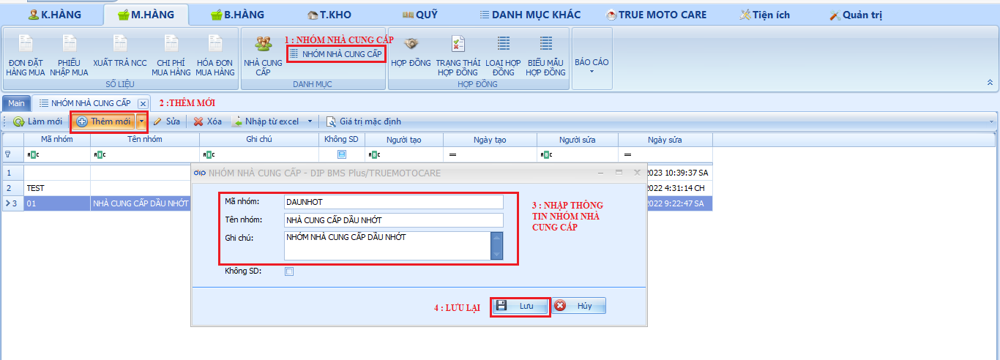

# Nhóm nhà cung cấp

Danh mục này giúp chủ cửa hàng phân nhóm quản lý trong trường hợp có nhiều hơn 01 nhà cung cấp trong cùng một ngành hàng, để có thể tạo mới nhóm nhà cung cấp thao tác cũng tương tự với việc tạo nhà cung cấp các bước thực hiện như sau :

Bước 1 : Chọn vào danh mục nhóm nhà cung cấp

Bước 2: Chọn thêm mới nhóm nhà cung cấp.

Bước 3: Nhập thông tin nhóm nhà cung cấp.

Bước 4: Lưu lại để hoàn tất tạo nhóm nhà cung cấp.

<figure><figcaption>
Nhóm nhà cung cấp.
</figcaption></figure>
