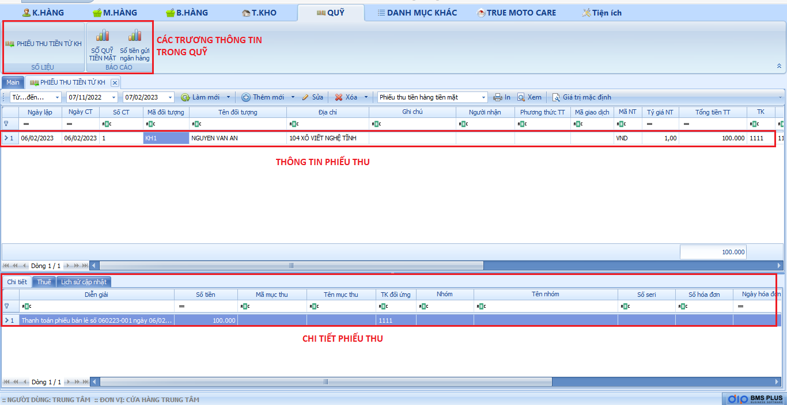

# Quỹ

Danh mục quỹ sẽ thể hiện một số trường thông tin như:

**Phiếu thu tiền từ khách hàng** : là phiếu thu tiền từ khách hàng có phát sinh nợ khi sử dụng dịch vụ tại cửa hàng.

**Số quỹ tiền mặt :** Là số tiền mà khách hàng thanh toán bằng hình thức tiền mặt Khi phát sinh giao dịch tại cửa hàng.

**Số tiền gửi ngân hàng** : Là số tiền mà khách hàng thanh toán bằng hình thức chuyển khoản khi phát sinh giao dịch tại cửa hàng.

<figure><figcaption>
Dạnh mục quỹ.
</figcaption></figure>
