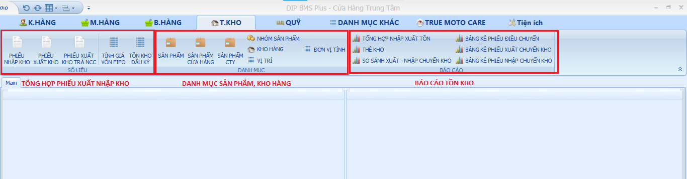

# Tồn Kho

Tồn kho được chia làm 03 mục chính:

**Số liệu:** Bao gồm các phiếu nhập, xuất kho và các công thức tính giá vốn Fifo và tồn kho đầu kỳ.

**Danh mục :** Bao gồm danh mục sản phẩm ( cửa hàng và True Moto Care), Kho hàng, Vị trí kho hàng..etc..

**Báo cáo :** Bao gồm các báo cáo liên quan đến tồn kho.

Dưới đây là hình ảnh tổng quan về danh mục tồn kho.

<figure><figcaption>
Danh mục tồn kho.
</figcaption></figure>
