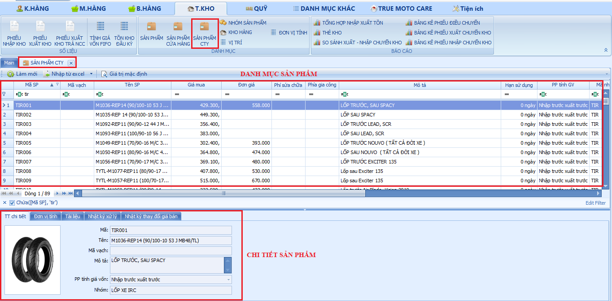
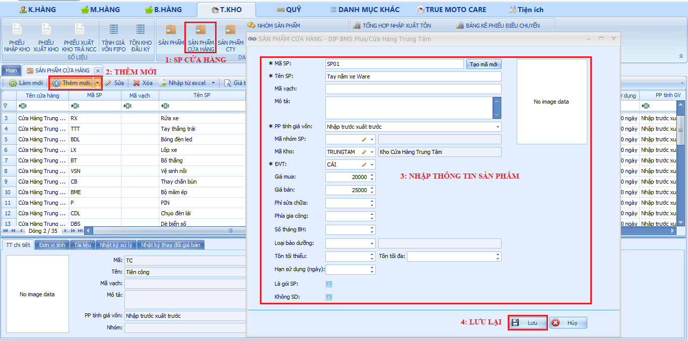

# Danh Mục

**Danh Mục**

**Sản phẩm công ty :** Là danh mục những sản phẩm của True Moto Care.

* Đã niêm yết giá bán NTD.
* Đã có giá công thợ.
* Đầy đủ thông tin sản phẩm.
* Có hình ảnh sản phẩm theo từng sản phẩm.

Dưới đây là hình ảnh tổng quan về sản phẩm công ty.

<figure><figcaption>
Sản phẩm công ty.
</figcaption></figure>

**Sản phẩm cửa hàng:** là những sản phẩm nằm ngoài danh mục sản phẩm của True Moto Care, trong mục này chủ cửa hàng phải nhập những sản phẩm cửa hàng đặt mua ngoài danh mục sản phẩm của công ty, để có thể tạo sản phẩm ta sẽ thao tác như sau:

Bước 1: Chọn vào mục sản phẩm cửa hàng.

Bước 2: Chọn thêm mới sản phẩm.

Bước 3: Nhập thông tin sản phẩm.

Bước 4 : Lưu lại để hoàn tất tạo sản phẩm.

<figure><figcaption>
Sản phẩm cửa hàng.
</figcaption></figure>

_<mark style="background-color:red;">Lưu ý : Các trường thông tin có đánh dấu (\*) là những trường bắt buộc phải điền vào.</mark>_

