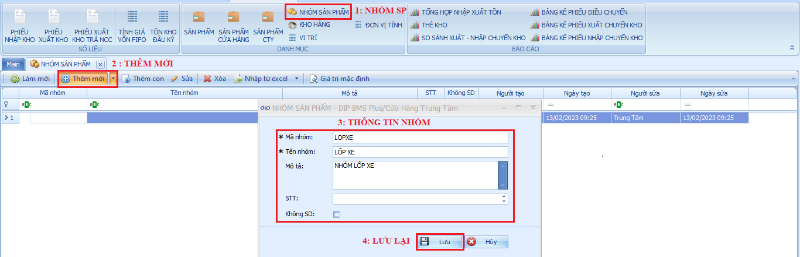

# Nhóm Sản Phẩm

**Nhóm sản phẩm :** là danh mục có chức băng nhóm các sản phẩm có chung một nhóm lại, giúp cho việc quản lý sản phẩm dễ dàng hơn, để tạo nhóm sản phẩm ta sẽ thao tác như sau :

Bước 1: Chọn vào mục nhóm sản phẩm.

Bước 2: Thêm mới

Bước 3: Nhập thông tin nhóm.

Bước 4: Lưu lại để hoàn tất tạo nhóm.

<figure><figcaption>
Nhóm sản phẩm.
</figcaption></figure>
